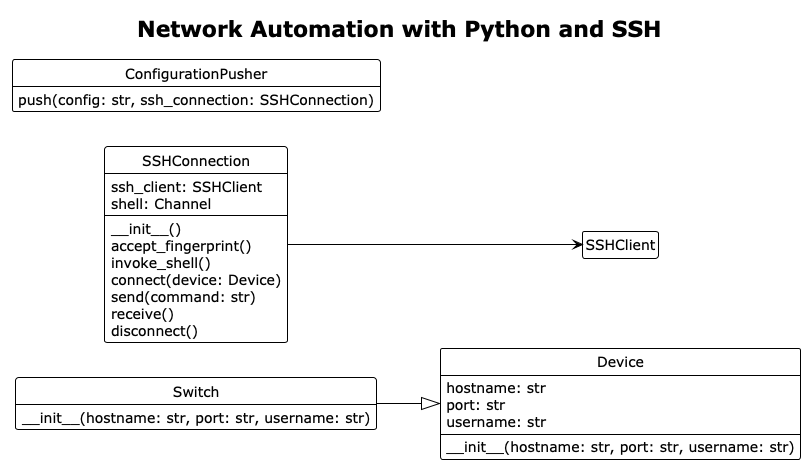

# Network Automation with Python and SSH

## About

This is an object-oriented programming project that focuses on the use of Python to automate the configuration of network devices via SSH. The main goal of this project is to learn how to leverage code to reduce the amount of manual configurations on network devices. The Python application has been tested on two Cisco Catalyst 2960-X Series switches which means that the rest of this document is in part written from the perspective of Cisco switches. 

## Class diagram



## A sample switch configuration

Before you can actually SSH into a switch it has to have SSH enabled and there needs to be a user account with appropriate user permissions. I've used the following set of commands to provision my switches with a basic configuration and prepare them for network automation with SSH.

```
enable
conf t

! Set hostname

hostname your_hostname

! Prevent resolving of mistyped commands

no ip domain lookup

! Configure a local user (best practice for SSH login)

username your_username privilege 15 secret

! Configure access via VTY (Telnet/SSH)

line vty 0 4
login local
transport input ssh
no exec-timeout
logging synchronous

! Enable SSH version 2

ip domain-name your-domain.local
crypto key generate rsa modulus 2048
ip ssh version 2

! Save running config to startup config

exit
wr mem
```

## How to use the software

### Clone the repository

```
git clone https://github.com/larsb-dev/network-automation-python-ssh.git
```

### Create a venv

```
python3 -m venv myvenv
```

### Activate the venv

```
source myvenv/bin/activate
```

### Install the dependencies

```
pip3 install -r requirements.txt
```

### Create a .env file in the project's root

```
nano .env
```

### Add the following user environment variables

```
IP_ADDRESS=your_ip_address
PORT=your_ssh_port
SSH_USER=your_username
```

### Open the project in your IDE of choice

```
pycharm .
```

### Run the application

```
python3 main.py
```

## Continuous improvement

One of the biggest limitations of the software at this point is that it can basically only configure one switch at a time. It is necessary to update the environment variable values every time another switch needs to be configured.

A possible solution to this limitation would be to create a JSON array of switches as an environment variable. After that, loop through the JSON array, create an object of type `Switch` for each item and add it to a list. Finally, iterate over the list of `Switch` objects and push the configuration file.

The benefits of automation haven't really become apparent to me by only configuring two switches. However, automation really shines when dozens of devices need to be configured the same or at least share a very similar configuration.

## Contact

You can reach me at [lars@larsb.dev](mailto:lars@larsb.dev).